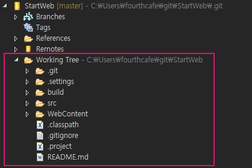
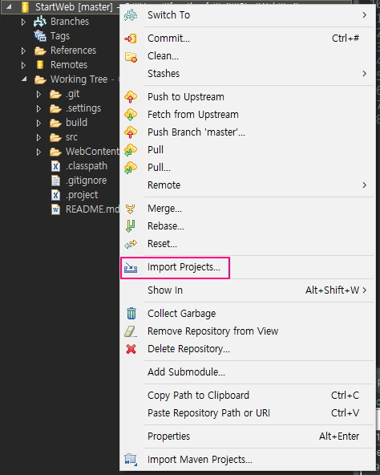
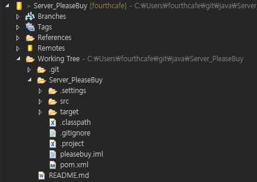
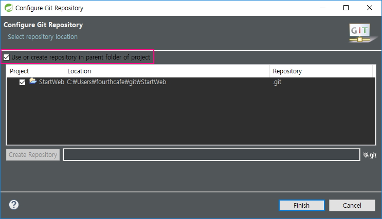

# Repository 만들기

## Eclipse

아래처럼 Git Repository를 생성하려고 한다.

주안점은 `Working Tree` 폴더 바로 하위 폴더에 소스와 README.md 파일이 있다는 점이다.

이렇게 생성을 해야 `Import Projects...` 메뉴를 통해 project를 바로 가져올 수 있다.

실제 github 대부분의 repository가 이와 같은 방식으로 되어 있고, IDE의 소스 폴더 내에서 README.md 파일을 확인할 수 있다.

하지만 <u>내가 평소 하던 방식</u>으로 생성을 하면 `Working Tree` 폴더 안에 프로젝트 폴더가 생기고 그 안에 소스 폴더가 생성된다.

### 내가 하던 방식(잘못된 방식)

local 하드의 workspace에서 프로젝트를 만들고 `[Team]-[share project]` 메뉴를 선택 후, 옵션에서 `[use or create in parent folder of project]`를 선택하지 않고 현재 workspace가 아닌 다른 폴더에 Git repository를 만든다. 이렇게 하면 Git repository가 아래처럼 생성된다.

이렇게 구성된 repository를 IDE에 불러오는 방법은 2가지가 있는데 각각의 문제가 있다.

1. `Working tree`에서 import project

	build path와 설정값을 읽어오지 못해 다시 잡아줘야 한다. 여간 번거롭고(잘 모르기도 하고) 팀단위 프로젝트에서 충돌이 발생할 수 있을 것 같다.

2. `프로젝트 폴더([Working tree]-[Server_PleaseBuy])`에서 import project

	README.md 파일을 IDE에서 확인할 수 없다.

### 어떻게 만들어야 할까?

1. Remote Repository를 먼저 생성

	이 경우 IDE `Clone Repository`를 한 후 Project Facets, Deploy Path, Build Path 등 설정값을 잡아줘야 하는데 어떻게 잡아줘야하는지 **전혀 모르겠다.**

2. Local Repository를 먼저 생성

	현재 지식으로 위의 방식이 어려운 상황에서, 기존의 방식-Local Repository를 먼저 만들어 Remote에 올리기-으로 repository를 만들면서 폴더 구조도 원하는 방식으로 만드는 방법을 고민한 결과, 방법을 찾았다.

	* 현재 project folder를 repository로 사용하기

	핵심은 `[Team]-[share project]` 메뉴 선택 후 나오는 폴더를 지정하는 단계에서 `[use or create in parent folder of project]` 옵션을 선택하는 것이다.

	

	이 옵션을 선택하면 현재 project folder를 git repository로 바로 전환하여 사용하게 된다. 기존에 이 옵션을 선택 안 했던 이유는 workspace와 git repository를 구분하여 사용하고 싶었기 때문이다. 하지만 지금은 이 방법 말고 현재 문제를 해결할 다른 방법이 떠오르지 않는다.

	게다가 git repository의 path가 맘에 안 든다면 Remote Repository가 설정되어 있으니 Local Repository를 삭제하고 Clone Repository로 원하는 경로에 다시 받으면 되니 path의 구분에 대한 고민도 사라졌다.
