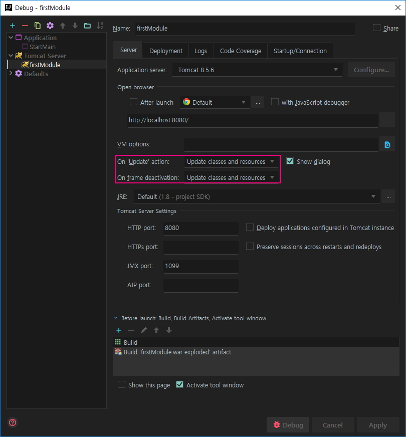
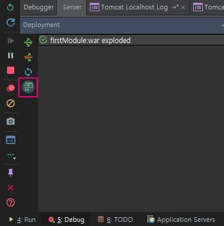

# IntelliJ Tip

## `찾기` 수행 시 배포 폴더 내용 표시 안 함

파일을 찾을 때(ctrl+shift+N) 배포 폴더 안에 있는 파일까지 검색이 되면 배포 폴더를 excluded 로 표시해라

## server auto publishing [REF](http://java.ihoney.pe.kr/277)

로컬 웹서버에서 테스트 중에 클래스나 JSP파일을 수정한 내용이 자동으로 배포되게 하기.

둘 중 하나를 설정하면 애플리케이션이 대기 상태가 될 때 변경사항을 확인하여 자동 배포가 된다.

- [Run]-[Edit Configurations]에서 [Server] 탭에서 `On 'Update' action`, `On frame deactivation` 항목을 `Update classes and resources`로 설정

	

- 왼쪽 하단 서버 항목 중 `Update Resources On Frame Deaction` 활성화

	
