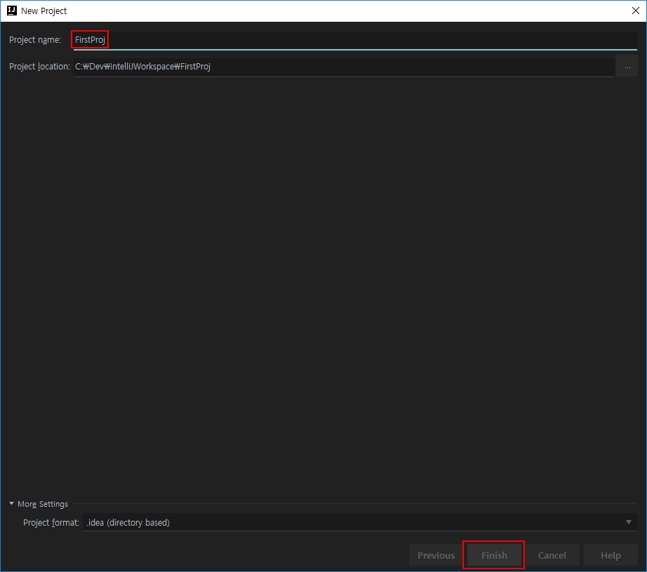

# IntelliJ 프로젝트 생성하기

개발을 시작할 때부터 줄곧 Eclipse만 사용해오다 IntelliJ로 갈아타려는데 두 IDE간에 소스를 다루는 방식이나 설정들이 달라 정리한다.

* [이클립스 프로젝트 가져오기](http://lhb0517.tistory.com/entry/IntelliJ-%EC%9D%B4%ED%81%B4%EB%A6%BD%EC%8A%A4-%ED%94%84%EB%A1%9C%EC%A0%9D%ED%8A%B8-%EC%9D%B8%ED%85%94%EB%A6%ACJ-%EB%A1%9C-%EA%B0%80%EC%A0%B8%EC%98%AC-%EB%95%8C%EC%9D%98-%EB%9D%BC%EC%9D%B4%EB%B8%8C%EB%9F%AC%EB%A6%AC-%EB%AC%B8%EC%A0%9C)
* [IntelliJ 웹 프로젝트 시작하기](http://altkeycode.tistory.com/17)

* [Eclipse vs IntelliJ 개념 비교](http://www.coolio.so/eclipse-vs-intellij-%EA%B0%9C%EB%85%90-%EB%B9%84%EA%B5%90/)

|ECLIPSE	|INTELLIJ
|:---|:---
|Workspace(Contains one or more projects)	|Project
|Project	|Module
|Project-specific JRE	|Module SDK
|User Library	|Global Library
|Classpath Variable |Path Variable
|Project Dependency	|Module Dependency
|Library	|Module Library

## 프로젝트와 모듈 생성 및 구성

* 프로젝트

	1. [create projects] 를 클릭하여	프로젝트를 생성한다.

	

	2. Eclipse와 IntelliJ의 가장 먼저 눈에 보이는 차이점이 이것인데 IntelliJ는 프로젝트 기반으로 폴더를 생성하여 한번에 하나의 프로젝트만 관리하는 방식을 기본으로 하고 있다고 한다.

	Visual Studio의 방식이라고 하던데 이 방식을 따를 경우엔 [Empty Project]가 아닌 원하는 proejct 방식을 선택하자.

	내 경우엔 한참을 Eclipse만 써왔기에 Workspace 방식이 익숙해서 가장 아래 [Empty Project] 를 선택하고 그 안에서 module을 만드는 방식을 택했다.

	

	3. 프로젝트명 기입 Project location은 현재 폴더 경로, Project name은 일단 동일하게 맞춰주었다. 기본적으로 권장사항인지 알아서 동일하게 입력해주더라.

	

	4. 현재까지 만들어진 프로젝트의 폴더 구조. 앞에서 입력했던 `FirstProj` 이란 이름으로 폴더가 생성되고 그 안에 `.idea`폴더가 생성되었다. IntelliJ와 방금 작성한 프로젝트의 설정 정보를 담는 폴더인 것 같다.

	

	5. 3번까지 진행을 하면 IntelliJ가 로딩 후 다음 화면이 보인다. 모듈을 추가하자.

	

	6. 웹개발을 할거니 [Java Enterprise]-[Web Application]을 선택하자.

	

	7. 서버를 추가하자.

	

	8. 톰캣 경로를 지정해준다.

	

	9. 모듈 이름과 경로 입력

	

	10. 모듈 생성 후 폴더 구조. 최종적으로 `C:\Dev\IntelliJWorkspace\ProjFourthcafe`로 프로젝트 안에 `firstModule` 모듈이 생성되었고 그 안에 `모듈이름.iml` 파일이 생성되었다.

	
